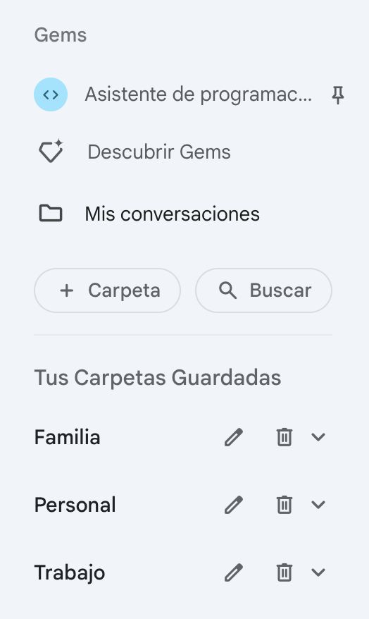
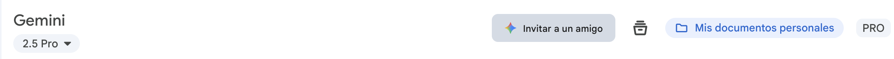
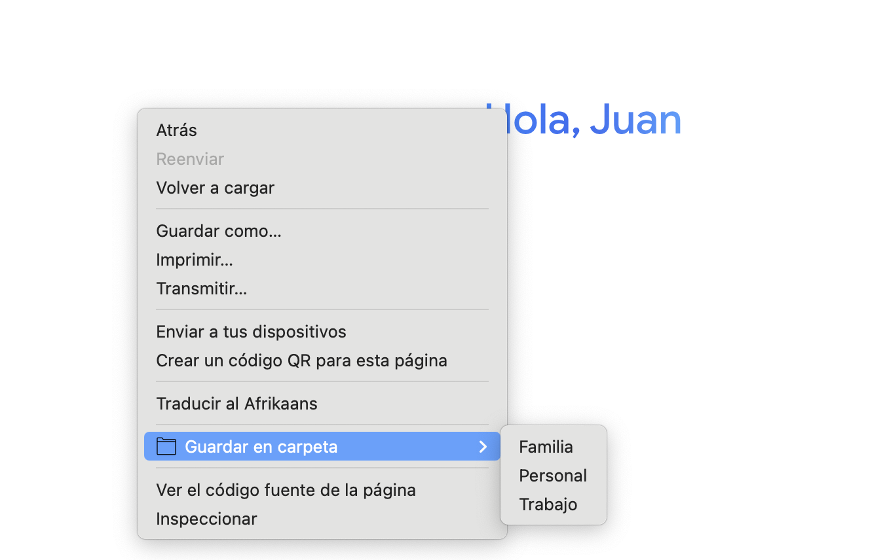
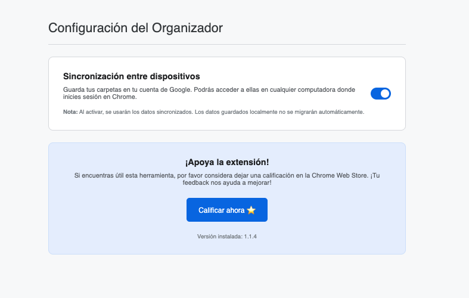

# 📁 Organizador de Conversaciones de Gemini (Beta)

¡Bienvenido a la versión beta del Organizador de Conversaciones de Gemini! Este complemento de Chrome te permite guardar y organizar tus conversaciones de Gemini en carpetas directamente desde la interfaz de usuario de Gemini, y luego volver a abrirlas con un solo clic.

---

## ✨ **Características Actuales:**



* **Crear Carpetas:** Organiza tus conversaciones en categorías personalizadas.
* **Guardar Conversaciones:** Guarda el título y el enlace de la conversación actual en una carpeta.
* **Abrir Conversaciones:** Haz clic en un título guardado para regresar instantáneamente a esa conversación en Gemini.
* **Eliminar Conversaciones:** Mantén tus carpetas limpias eliminando las conversaciones que ya no necesitas.
* **Interfaz Integrada:** Un botón "Organizador" en la barra lateral de Gemini para invocar el panel, que aparece discretamente en la parte inferior derecha.
* **Indicador de carpeta actual de conversación:** Entiende rápidamente en que carpeta está tu conversación 
* **Guarda tu conversación con 1 click:** Desde el menú contextual podés guardar la conversación actual en una carpeta. 
* **Sincronización multidispositivos:** Desde la versión 1.1.4 se puede activar la sincronización con tu cuenta de Google gracias al chrome.storage.sync 
* **Importar y Exportar:** Realiza copias de seguridad de todas tus carpetas y conversaciones en un archivo `.json`. Importa desde un archivo de respaldo para restaurar o fusionar tus datos fácilmente.

**Opciones de la herramienta**

!

---

## ⚠️ **Estado de la Beta:**

Este es un proyecto en desarrollo. Es posible que encuentres errores o que la funcionalidad no sea perfecta. ¡Tu feedback es muy valioso para mejorarlo!

---

## 🚀 **Cómo Instalar:**

### Chrome web store

Puedes descargar la versión estable productiva desde el store de Chrome: [Organizador de Conversaciones de Gemini](https://chromewebstore.google.com/detail/gafkcjhjichbmdclinadljhmpaenmpgd?utm_source=item-share-cb)

### Versión Beta - Modo Desarrollador

Para instalar esta extensión localmente, necesitarás Node.js y npm instalados en tu sistema. El proceso ahora incluye un paso de compilación para empaquetar los scripts.

1.  **Obtén el Código Fuente:**
    * **Opción A (con Git):** Clona el repositorio en tu máquina.
        ```bash
        git clone [https://github.com/jmibarra/gemini-conversation-folders-addon.git](https://github.com/jmibarra/gemini-conversation-folders-addon.git)
        ```
    * **Opción B (Descarga ZIP):**
        * Ve a la página principal de este repositorio en GitHub.
        * Haz clic en el botón verde **"Code"** y luego selecciona **"Download ZIP"**.
        * Descomprime el archivo ZIP en una ubicación permanente en tu computadora.

2.  **Compila la Extensión:**
    * Abre una terminal y navega hasta la carpeta del proyecto que acabas de clonar o descomprimir.
    * Instala las dependencias necesarias:
        ```bash
        npm install
        ```
    * Ejecuta el script de compilación para generar los archivos finales:
        ```bash
        npm run build
        ```
    * Este comando creará una nueva carpeta `dist` que contendrá el script empaquetado de la extensión.

3.  **Activa el Modo Desarrollador en Chrome:**
    * Abre Google Chrome.
    * En la barra de direcciones, escribe `chrome://extensions` y presiona Enter.
    * En la esquina superior derecha de la página de Extensiones, activa el interruptor que dice **"Modo de desarrollador"**.

4.  **Carga el Complemento:**
    * Una vez activado el "Modo de desarrollador", haz clic en el botón **"Cargar extensión sin empaquetar"**.
    * Se abrirá una ventana para seleccionar una carpeta. **Navega y selecciona la carpeta raíz del proyecto** (la que contiene `manifest.json`, `src/` y la carpeta `dist/` que acabas de crear).
    * **Selecciona esa carpeta y haz clic en "Seleccionar carpeta".**

5.  **¡Listo!**
    * El "Organizador de Conversaciones de Gemini" debería aparecer ahora en tu lista de extensiones.
    * Puedes hacer clic en el icono de la pieza de rompecabezas (🧩) en la barra de herramientas de Chrome y **fijar** (el icono de pin) el complemento para un acceso más fácil.

---

## 💡 **Cómo Usar:**

1.  Abre `https://gemini.google.com/` en tu navegador.
2.  Verás un nuevo botón **"Mis conversaciones"** en la barra lateral izquierda de Gemini (debajo de "Descubrir Gems"). Haz clic en él para abrir/cerrar el panel.
3.  Usa el panel para crear carpetas, guardar la conversación actual y acceder a tus chats guardados.

---

## 🐞 Reporta un Problema

Si encuentras algún error o tienes una idea para mejorar el libro, abre un **Issue** en nuestro [tablero de Issues](https://github.com/jmibarra/gemini-conversation-folders-addon/issues). Por favor, incluye detalles claros y pasos para reproducir el problema si corresponde.

---

## 🤝 Contribución

¡Las contribuciones son bienvenidas! Si tienes ideas para nuevas funcionalidades, mejoras de rendimiento o correcciones de errores, me encantaría que colaboraras.

### Proceso de Colaboración (Pull Requests)

1.  **Haz un *Fork*** del repositorio.
2.  **Crea una rama** para tu funcionalidad o corrección (`git checkout -b feature/MiNuevaMejora`).
3.  **Realiza tus cambios** y haz *commit* con un mensaje descriptivo.
4.  **Sube tu rama** a tu *fork* (`git push origin feature/MiNuevaMejora`).
5.  **Abre un *Pull Request*** (PR) detallando los cambios que has realizado y por qué son necesarios.

---

## 📬 Comunícate

Si tienes dudas o necesitas orientación, no dudes en contactarnos a través de los Issues o mail:  
✉️ [jmibarra86@gmail.com](mailto:jmibarra86@gmail.com)

También puedes encontrarme en LinkedIn:  
🔗 [Juan Manuel Ibarra - LinkedIn](https://www.linkedin.com/in/juan-manuel-ibarra-activity/)

## 🔑 Política de privacidad

Si tienes dudas puedes ver nuestra [política de privacidad](https://gist.github.com/jmibarra/cbaef743ac38b6c98e5c115f4f5310ad).

---

**¡Gracias por contribuir a mejorar esta herramienta!** 🌟  
Juntos podemos construir un recurso útil y abierto para la comunidad. 🙌

Si te gusta este proyecto y querés apoyar su desarrollo:

[](https://cafecito.app/jmibarradev)
