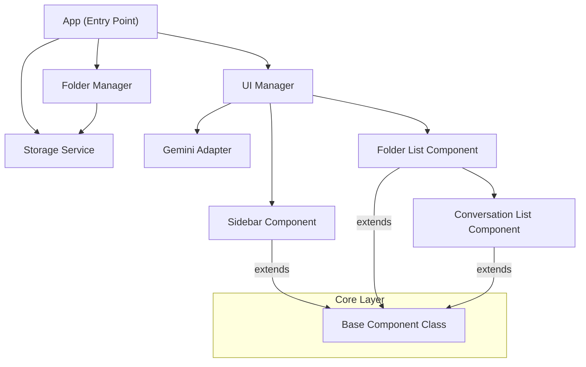

# Arquitectura de la Solución

Este documento describe la arquitectura técnica del complemento **Organizador de Conversaciones de Gemini**. La solución sigue un patrón de diseño modular basado en componentes, separando la lógica de presentación, la gestión de estado y la interacción con la plataforma host (Gemini).

## Visión General

La extensión funciona inyectando scripts (`content script`) en la página web de Gemini. La arquitectura se ha refactorizado para evitar la manipulación directa y dispersa del DOM, centralizando la lógica en componentes reutilizables y servicios especializados.

### Diagrama de Alto Nivel

## Capas de la Aplicación

### 1. Core (`src/scripts/core`)

Contiene las clases base que definen el comportamiento fundamental de los bloques de construcción de la aplicación.

- **`Component.js`**: Clase base abstracta para todos los elementos de UI. Implementa un ciclo de vida de renderizado simple y reactivo basado en estado (`setState`, `render`, `create`, `mount`).

### 2. Servicios (`src/scripts/services`)

Módulos encargados de interactuar con APIs externas o el entorno.

- **`GeminiAdapter.js`**: Abstrae la interacción con el DOM de Gemini. Centraliza los selectores CSS y la lógica para encontrar puntos de inyección, protegiendo a la extensión de cambios menores en la UI de Google.

### 3. Componentes (`src/scripts/components`)

Elementos de interfaz de usuario que extienden de `Component`. Son responsables de su propia estructura HTML y manejo de eventos.

- **`Sidebar`**: Contenedor principal del panel lateral.
- **`FolderList`**: Gestiona y renderiza la lista de carpetas.
- **`ConversationList`**: Gestiona los ítems de conversación individuales y sus acciones (arrastrar, borrar, abrir).

### 4. Gestores de Lógica (`src/scripts/`)

Clases que orquestan la lógica de negocio.

- **`App.js`**: Punto de entrada. Inicializa los servicios y observa cambios en la página (`MutationObserver`) para re-inyectar la UI si es necesario.
- **`FolderManager.js`**: Contiene la lógica de negocio para crear, renombrar y eliminar carpetas/conversaciones.
- **`Storage.js`**: Wrapper sobre `chrome.storage` para manejar la persistencia de datos (local o sync).

## Flujo de Datos

1. **Inicialización**: `App` instancia `Storage` y `UI`.
2. **Detección**: `App` usa `MutationObserver` para detectar cuándo la UI de Gemini está lista.
3. **Inyección**: `UI` usa `GeminiAdapter` para encontrar dónde insertar el botón "Mis conversaciones".
4. **Renderizado**: `UI` instancia `Sidebar` y llama a `FolderList` para renderizar las carpetas obtenidas del `Storage`.
5. **Interacción**: Los eventos de usuario (clicks, drag&drop) son manejados por `EventHandler` o directamente por los componentes, que invocan métodos de `FolderManager` para actualizar el estado persistente.
